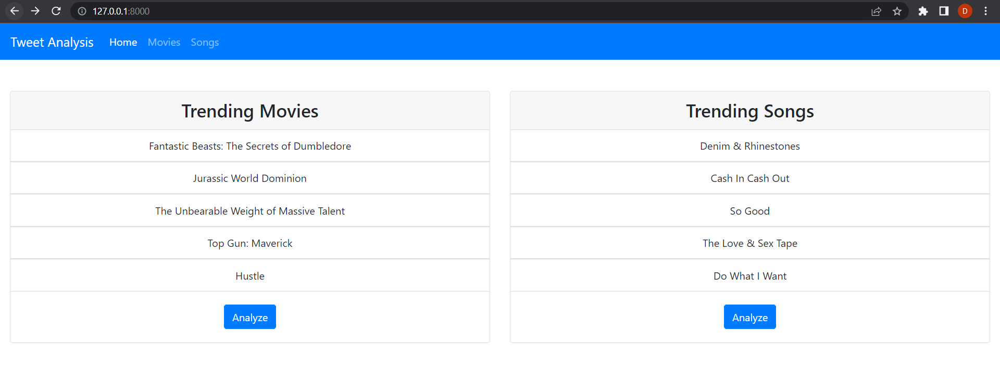
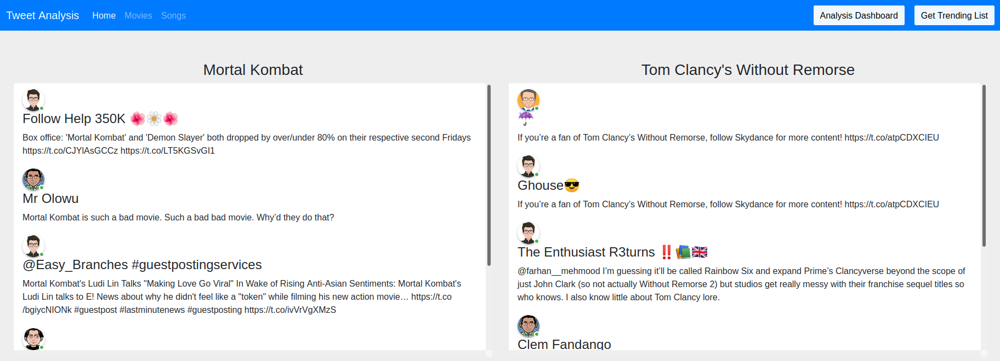
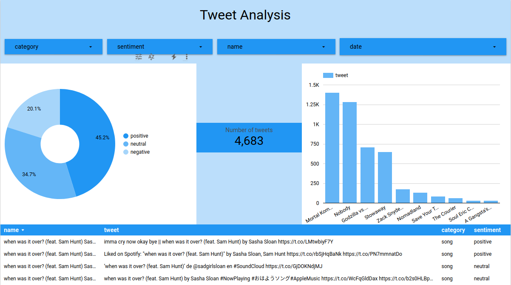

# Movie/Songs Recommendation based on Tweet Analysis

### Website Preview
##### Home Page


##### Tweets Page


##### Dashboard Page


##### Server running

----

## Problem Description 📋
⚡️ This Web application will provide the users the comfort of not scrolling the whole twitter feed page to find out the general perception of the other users and critics about the movies or songs that they would want to watch or listen to in the future. The application will provide real time analysis of tweets.

## Installation 📦

>Clone this repository

#### Install libraries
>pip install -r requirements.txt

#### Run server locally

```shell
$ cd tweet_twitter
$ python manage.py runserver
```
> Go to localhost:8000

---
## Features 📋
⚡️ The latest songs and movies will be fetched from Spotify and TMDB.
⚡️ Sentiment analysis of the feed visually represented in data studio.
⚡️ Trending movies and songs will be emailed to the user specified email id for their record so that the user can play or watch the movies or songs in their free time.


## Creator ✨

| <a href="https://coder-freak.github.io/dhanushb.github.io/" target="_blank">**Dhanush Balaji**</a> | 
| :---: |
| [](https://coder-freak.github.io/dhanushb.github.io/)    | 
| <a href="https://github.com/coder-freak" target="_blank">`github.com/coder-freak`</a> | 

## License
- **[MIT license](http://opensource.org/licenses/mit-license.php)**
